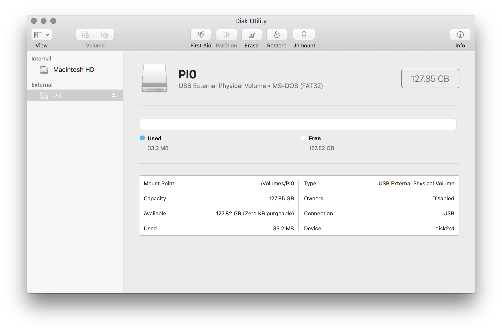

# Kubernetes cluster on Raspberry Pi 4b with 64-bit OS from scratch

## Hardware

### Bill of materials

Three [Raspberry Pi 4 Model B](https://www.amazon.co.uk/gp/product/B07TC2BK1X/) 4GB, ARM-Cortex-A72 4x 1.50GHz (from now on RPI):


A rack for the RPIs, [Jun_Electronic Gray Stackable Case](https://www.amazon.co.uk/gp/product/B07F6Y1MJ6/):


[SanDisk Ultra 128 GB microSDXC](https://www.amazon.co.uk/gp/product/B073JYC4XM/) memory card:


[D-Link GO-SW-8G 8-Port Gigabit switch](https://www.amazon.co.uk/gp/product/B008PC1MSO/) to hard-wire the RPIs via Ethernet cables:


[Anker PowerPort 60 W 6-Port](https://www.amazon.co.uk/gp/product/B00PK1IIJY/) 
as the power supply:


[TP-Link TL-MR3020 V3 wireless router](https://www.amazon.co.uk/gp/product/B078GXZJHP/r):
TBD.

Also, you'll need the following items:

- 3x [USB C to USB A cables](https://www.amazon.co.uk/gp/product/B07W12JK3J/) for powering the RPIs.
- 3x [cat6 Ethernet cables](https://www.amazon.co.uk/gp/product/B01J8KFTB2/) for connecting the RPIs to the switch.
- 1x HDMI-on-micro-HDMI cable to connect a screen to an RPI.
- 1x USB keyboard.

Then follow steps to [assemble](https://projects.raspberrypi.org/en/projects/raspberry-pi-setting-up/4) RPIs.

### Final setup

TBD: show final setup and connections.

## Software

Following the steps outlined in [Installing Ubuntu 19.10 on Raspberry Pi](http://sirchia.cloud/2019/11/installing-ubuntu-19.10-on-raspberry-pi/).
I'm using macOS as the host operating system.

### 1. Preparing the SD cards

Open up the disk utility app and erase/format the SD cards using the `MS-DOS (FAT)` format:



### 2. Install the Operating System on the SD cards

Download a 64bit Linux OS. For example, grab [Ubuntu 19.10](http://cdimage.ubuntu.com/releases/19.10/release/),
that is, download the file `ubuntu-19.10.1-preinstalled-server-arm64+raspi3.img.xz` and extract the image like so:

```sh
$ xz -d ubuntu-19.10.1-preinstalled-server-arm64+raspi3.img.xz
```

Now, flash the SD card (install the OS, make it bootable) using the following sequence:

```sh
# have a look what is mounted:
$ diskutil list
...
/dev/disk2 (external, physical):
   #:                       TYPE NAME                    SIZE       IDENTIFIER
   0:     FDisk_partition_scheme                        *127.9 GB   disk2
   1:                 DOS_FAT_32 PI0                     127.8 GB   disk2s1

# unmount the SD card:
$ diskutil unmountdisk /dev/disk2
Unmount of all volumes on disk2 was successful

# now, flash the SD card with the OS:
$ sudo dd if=ubuntu-19.10.1-preinstalled-server-arm64+raspi3.img of=/dev/disk2 bs=2m
1485+1 records in
1485+1 records out
3115115520 bytes transferred in 126.646778 secs (24596879 bytes/sec)

# flush cache (pending disk writes):
$ sync /dev/disk2

# eject SD card so you can insert into the Pi:
$ diskutil eject /dev/disk2
Disk /dev/disk2 ejected
```

### 3. Initial setup of the Operating System

As per [instructions](https://ubuntu.com/download/raspberry-pi), log in 
with `ubuntu` and `ubuntu`. The system tells you to change the password at first login.

Next, we set up the network in a way that the three RPIs are using statically assigned
IP addresses `192.168.1.42` to `192.168.1.44` when connected via the switch (Ethernet cables)
and get assigned dynamic IP addresses via DHCP, in addition to that, for the wireless
networking. We will use the static IPs for the Kubernetes setup.

For this to work, remove all files from `/etc/netplan/` and create a new file called [my-net-config.yaml](software/my-net-config.yaml) with the following info (note: here shown for the future control plane node with IP `192.168.1.42`, that value has to be changed for each RPI): 

```yaml
network:
  version: 2
  ethernets:
    eth0:
      dhcp4: false
      addresses: [192.168.1.42/24]
      gateway4: 192.168.1.254
      nameservers:
        addresses: [8.8.8.8, 4.4.4.4]
  wifis:
    wlan0:
      dhcp4: true
      access-points:
        "MY-NETWORK-SSID":
          password: "MY-NETWORK-PASSWORD"
```

Note: the value for `gateway4` is your router or default gateway and for your convenience you can get the template via `curl -L https://301.sh/rpi-net`.

To apply the changes, run `sudo netplan --debug try`, then `sudo netplan --debug generate`,
`sudo netplan --debug apply`, and `reboot` for good measures. Once the RPI comes
back up again, you can check the network configuration with `ip addr`.

Finally, before you proceed, update the system: 

```sh
sudo apt update
sudo apt upgrade
```

Now we have the basic OS-level config in place, let's make it a little more secure.

### 4. Configure SSH

At this point in time, you should be able to SSH into your RPIs like so:

```sh
$ ssh ubuntu@192.168.1.42
...
ubuntu@ubuntu:~$
```

Following [instructions](https://help.ubuntu.com/community/SSH/OpenSSH/Configuring)

Create SSH key, copy to USB.

In `/etc/ssh/sshd_config` set `PasswordAuthentication no`.

### 5. Install Kubernetes

Get `k3up`:

```sh
$curl -SLsf https://get.k3sup.dev | sudo sh
aarch64
...
```

Create a new cluster by provisioning the control plane:

```sh
$ export SERVER_IP=192.168.1.42

$ k3sup install --ip $SERVER_IP --user ubuntu
```

Join a worker node to the cluster:

```sh
$ export SERVER_IP=192.168.1.42
$ export AGENT_IP=192.168.1.43

$ k3sup join --ip $AGENT_IP --server-ip $SERVER_IP --user pi
```

### References

### Articles

In the process of preparing this walkthrough, I've perused the following articles:

- [Kubernetes On 64 Bit OS Raspberry Pi 4](http://sirchia.cloud/2019/12/kubernetes-on-64-bit-os-raspberry-pi-4/), 12/2019, by Robert Sirchia
- [Kubernetes Homelab with Raspberry Pi and k3sup](https://blog.alexellis.io/raspberry-pi-homelab-with-k3sup/), 10/2019, by Alex Ellis
- [How I made a Kubernetes cluster with five Raspberry Pis](https://www.zenko.io/blog/how-i-made-a-kubernetes-cluster-with-a-couple-of-raspberry-pis/), 05/2019, by Salim Salaues
- [Building a hybrid x86–64 and ARM Kubernetes Cluster](https://medium.com/@carlosedp/building-a-hybrid-x86-64-and-arm-kubernetes-cluster-e7f94ff6e51d), 01/2019, by Carlos Eduardo

### Docs

The following docs are useful:

- RPI docs: [Setting up your Raspberry Pi](https://projects.raspberrypi.org/en/projects/raspberry-pi-setting-up)
- Ubuntu docs: [SSH](https://help.ubuntu.com/community/SSH/)
- K3s docs: [Installation](https://rancher.com/docs/k3s/latest/en/installation/)